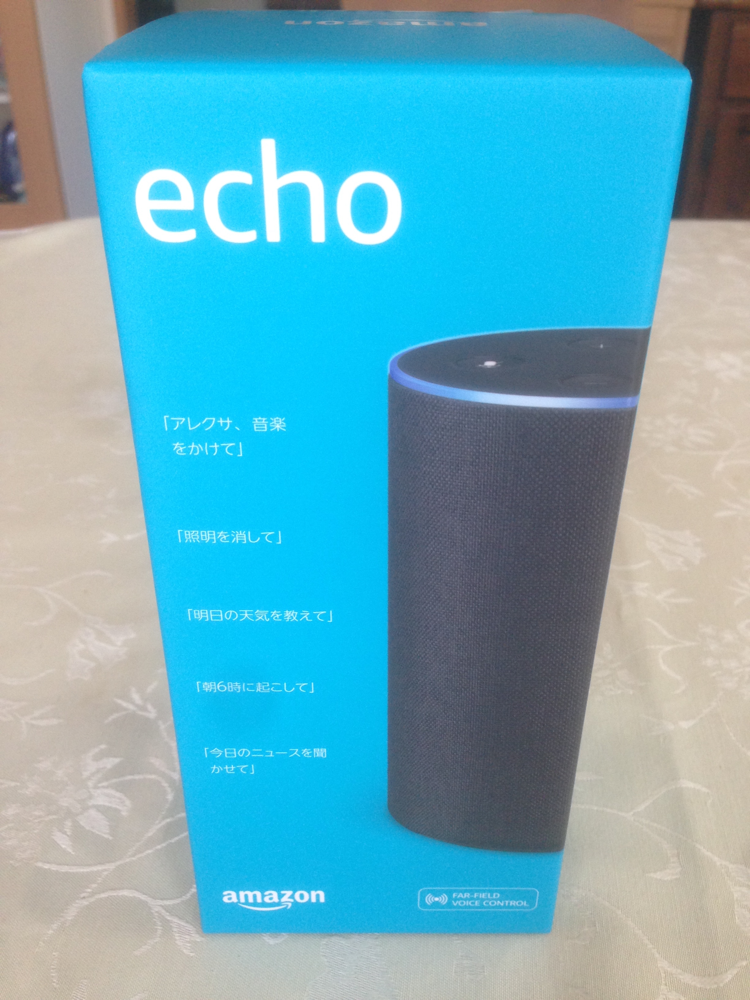
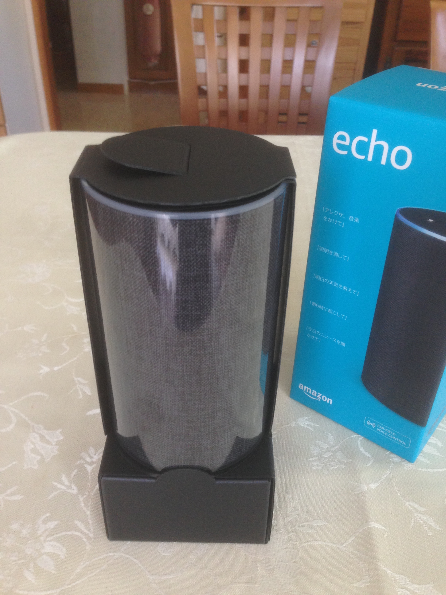
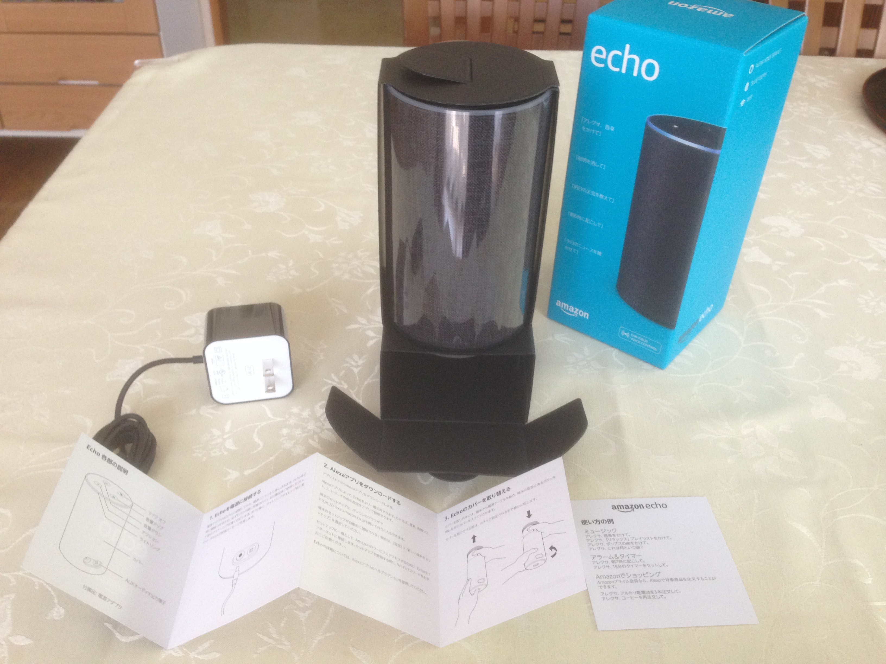
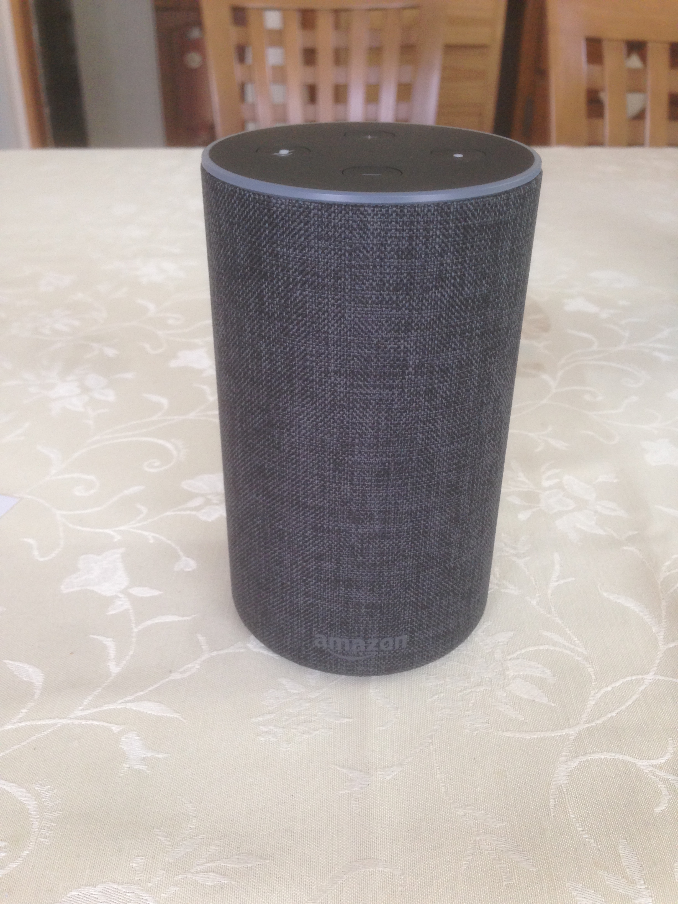
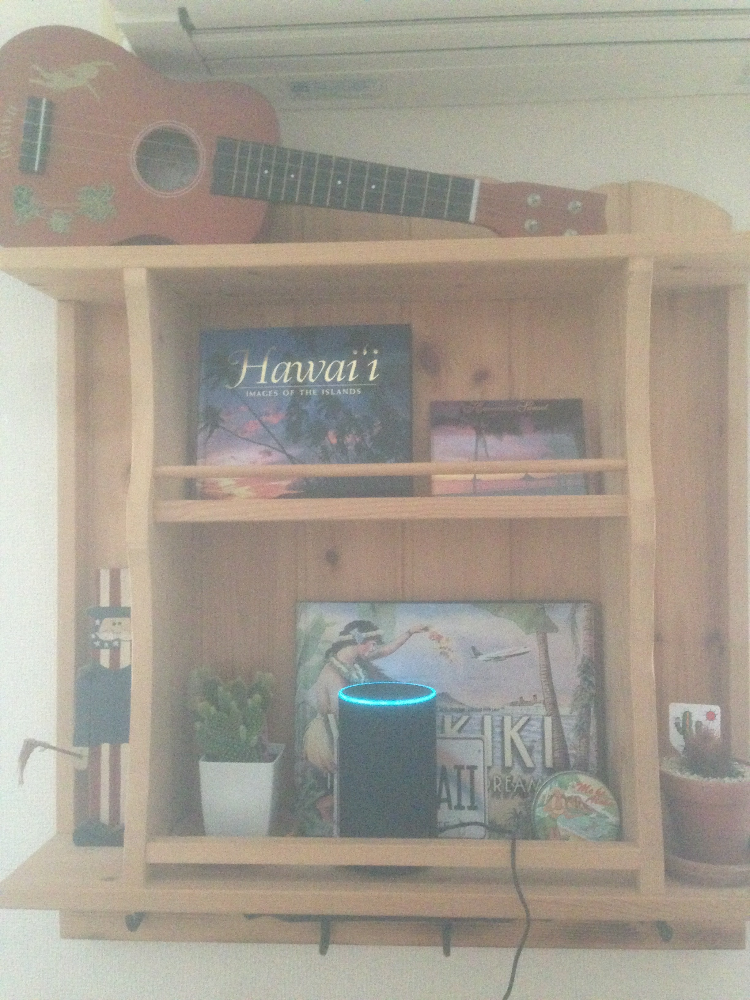

# Amazon Echoを購入しました

(posted at 2018/4/29)

来たるべきAIエージェント時代に備えるべく、我が家にお呼ばれされてもらいました。  
タイムセールで9,560円也。2ヶ月前、まだ招待制だった時に定価で買わずに正解だった...。

開封していきましょう。

</img>

821g、小型スピーカーなりにズシリとくる重さ(エントリーモデルのecho dotだとたった163gらしい)。 
と、小奇麗なおめかし

</img>

本体とアダプタ、そして最小限のリーフレットだけが封入されています。

</img>

ファブリックの質感は想像通りでした。良き。

</img>

率直な第一印象は、 AIエージェント時代、まだまだこれからスタートやな..！ という感じでした。  
英語圏だともっと印象が上向くのかもしれませんが。

話には聞いていたものの、日本語の認識率もう少し頑張ってみましょうかってのと(発話者の滑舌が悪すぎるって可能性も否定できない)、  
会話のクセを掴むため、こちら側が歩み寄っていく必要があり、  
人間同士の自然な会話のようなものを求めるのは、まだまだ高望みしすぎでした🧐

セットアップを終え、フラッシュニュースやラジオを流したり、リスニングクイズで遊んだり、ピカチュウとひとしきり戯れたあとは、それなりに疲労感を覚えるような感じに😅  
これからお互いどんどん話していけば、きっと仲良くなれるはず。

</img>

これからAlexa氏とのあまのじゃくな会話を楽しみながら、  
AIが席巻する未来に、思いをぐんぐん馳せていけたらと思います。  
ここまで来たら当然Amazon Music Unlimited登録するしかねぇ... となったので(マーケティングには楽勝で屈していく)、そちらの体験も楽しみです。

そして当然スキル開発も...！  
AWSはこれまで培ってこなかった概念に溢れていてとにかく難しそう...という印象をずっと拭えずにいるのですが、これを好機と捉え、胆力で突破していきたいです💪