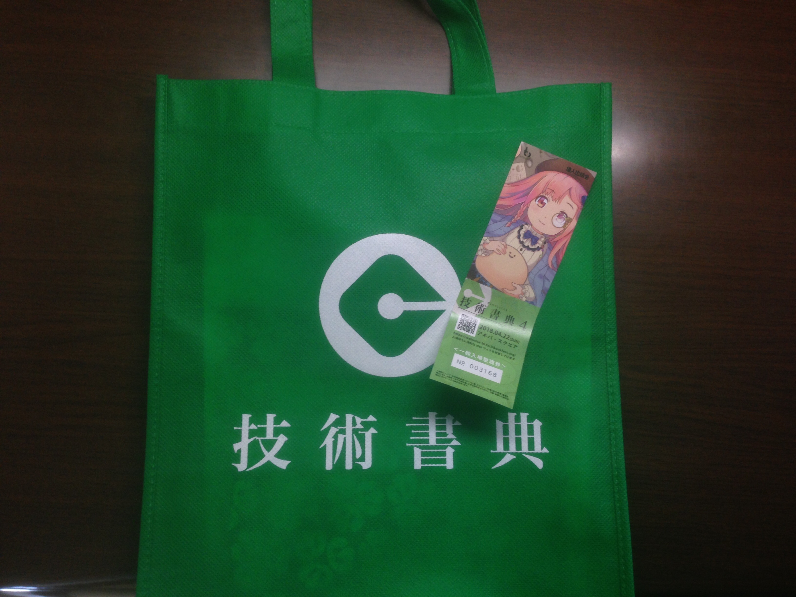
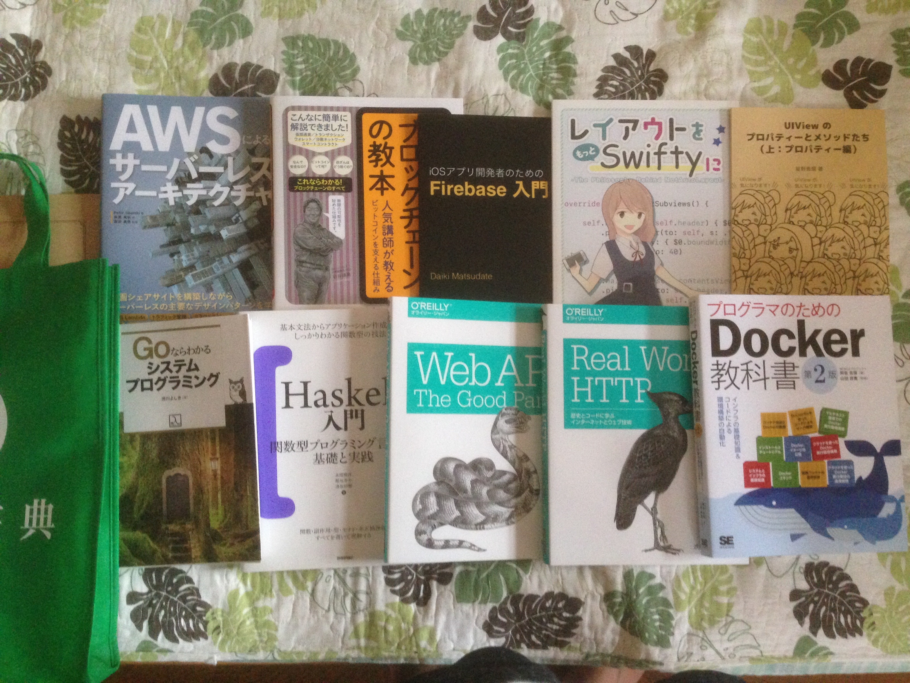

# 技術書典4に行ってきました

(posted at 2018/4/29)

帰国前からどうにもこうにも楽しみにしていた技術書の祭典。

当日は晴れ晴れとした空模様。  
到着した時点で1,200人待ち。整理券をもらい、カフェモカ片手に1時間ほど待機で入場できました。

`@lovee`さん、`@d_date`さん、本は買えなかったけど`@shu223`さん...など、  
百戦錬磨のiOS覇者たちにご挨拶できたのも非常に嬉しかったな。  
それからラムダノートの社長さんにも。(でしたよね...？)  
当面は日本に足をつけてやっていくことですし、  
今後は勉強会やカンファレンスにもアクティブに、仲間たちと交流を深めて行きたい機運です。

</img>

サークル参加者も含めた累計参加者数は6,300人とのこと。  
注目度も高まり、今後もっと大きくなっていくだろうと言われているので、  
次回以降はさらに大きな会場で開催...ということもあるかもしれません。

現場での釣果はこちら。

- iOSアプリ開発者のためのFirebase入門
- UIViewのプロパティーとメソッドたち(上: プロパティー編)
- レイアウトを、もっとSwiftyに
- Goならわかるシステムプログラミング
- いちばんやさしいブロックチェーンの教本
- AWSによるサーバーレスアーキテクチャ

同人誌は3冊しか買ってないじゃん、ってのは触れない方向で。  
もっと早く行ってれば`@ktanaka117`さんのTDD本、`@erukiti`さんのブロックチェーン本も欲しかったんだよぅ...。

</img>

その後新宿のブックファーストで買い増しして、トータルの釣果はこんな感じ。  
海外生活で抑圧された書籍欠乏症も、無事ある程度克服できてよかったです✨やっぱ本だな。

休日をも捧げてこのような熱気ある場を作り出す / 技術の獲得に貪欲である、  
日本人開発者たちの技術に対する生真面目さが好きです。  s
少しでもその背中に迫れるよう、やっていきましょう。