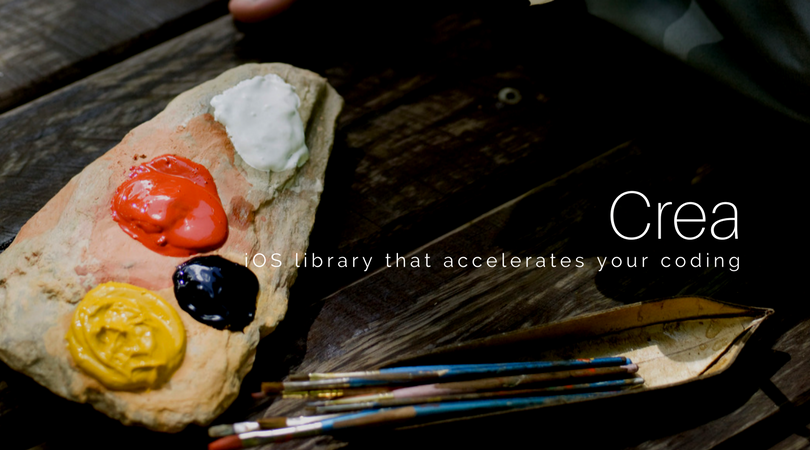
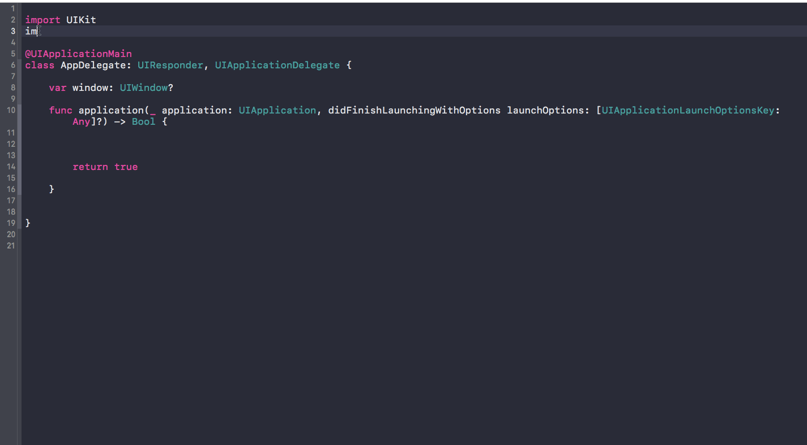

# crea

## about

### 🏃 Own library that supports my crazy iOS dev life 🏃

</img>

 

|media|value|
|---|---|
|term|2017.8(for 1 weeks)|
|stack|iOS, Swift 3|
|library|Jazzy(for documentation)|
|link|GitHub

## Function

As I keep on making iOS app, I noticed that I've always been writing same code or some pattern that appears so often. I thought that now was the time to make my own framework. I put a lot of useful extension so that I could write a code in a type-safe way and more efficiently. The most remarkable characteristics is that all methods in this library are invoked through a special property "crea", that is, I follow the notation as RxSwift and KingFisher does. Through this project, I've been learning how to make an iOS framework and maintain the project.

</img>