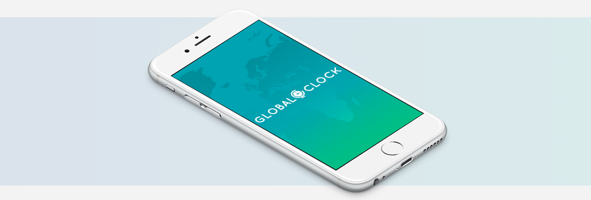
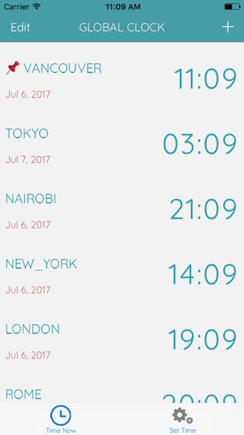
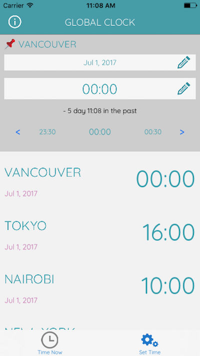

# Global Clock

## about

### ⌚ 国際会議のセッティングに。シンプルな世界時計 ⌚
 

 

    

    

|media|value|
|---|---|
|term|2017.6(for 3 weeks)|
|stack|Universal(iOS & iPad), Swift 3|
|library|Realm|
|link|App Store / Google Play|

## 機能
- 世界の都市の現在時刻をカンタン比較
    - 「未来のある時刻」を指定し、その時の世界の都市の時間を比較
        - 国際会議・Skypeミーティングのセッティングなどにご活用ください