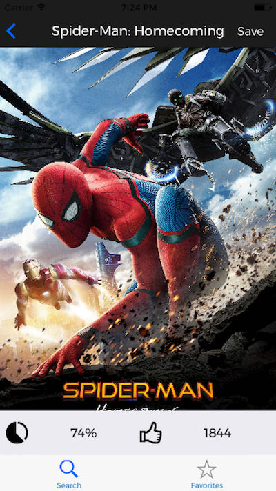
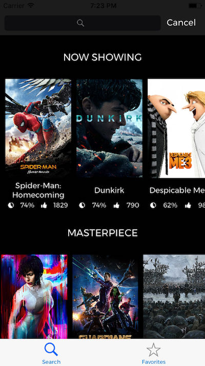
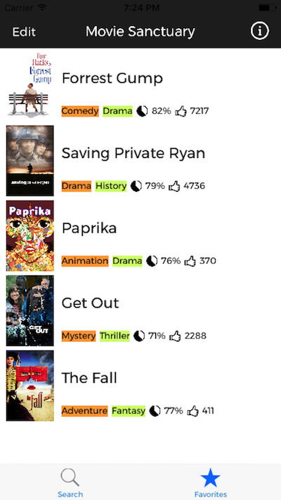

# Movie Sanctuary

## about

### 🎬 ユーザー嗜好に基づくレコメンドエンジンを備えた映画データベース 🎬

 

 

    

    

    

 
 

|media|value|
|---|---|
|term|2017.7(for 1 month)|
|stack|Universal(iOS & iPad), Swift 3|
|library|APIKit, Himotoki, KingFisher, Realm|
|API|TMDb API|
|link|App Store|

## 機能

- 機能的かつスタイリッシュなインターフェース
- 上映中・ジャンル別・名作選など、多彩な切り口で未知なる映画とのセレンディピティを演出
- 監督・俳優などから予算・興行収入に至るまで、充実したデータ群
- ユーザーの閲覧履歴の傾向を捉え、適切な作品を提案するレコメンド機能
- ローカルお気に入り保存

## 動機・問題意識

MVC・テーブルビュー・ネットワーク通信・Web APIの活用、CRUD処理...など、  
あらゆるアプリが備える基本機能を全て網羅して丁寧に作り込みつつ、  
当時持っていた技術を全て注ぎ込み、名刺代わりの一作を生み出そうという動機で開発に臨んだ。  

## 技術的挑戦・凝った箇所・悩んだ箇所

### 目を惹くインターフェース

名刺代わり、すなわち見た目のインパクトを重視したかったため、デザインが優れていると感じたアプリの模写を決意。 Spotify for iOSを参考に、その世界観に触れながら`CollectionItem in TableViewCell`などを学んだ。

個別具体的な実装について触れると、例えば以下のような工夫を随所に凝らした。

- 各セルの再利用時、各collectionViewの水平方向のオフセットをキープしておき、違和感のない挙動を実現した
    - `var storedOffsets: [Int : CGFloat]`を用意し、各セクションを管理  
    `tableView(_:didEndDisplaying:forRowAt:)`で`tableViewCell.collectionViewOffset`を一時保存、 `tableView(_:willDisplay:forRowAt:)`でその値を読み取り、再セット

セルの先読み・シームレスな表示(無限スクロール)   
- cellForRowで二重三重に呼ばれないようにするには？
    - isFetching: Boolのような変数を作り、自前管理

scrollView内にtableViewを設置する時の要注意事項  
- `tableView`の高さを自身のコンテンツの高さにぴったり合わせないと、  
`tableView`(内部)の方がスクロールするようになり、`scrollView`(外側)のスクロールがジャックされてしまい、不快な操作感に  
    - `tableView`の正確な高さを返してくれるプロパティがあり、 そこで得た値を元に、  
      `viewDidLayoutSubView`で制約を更新してあげればよい  
      `self.tableViewHeight.constant = self.tableView.contentSize.Height`

### Realmにまつわるデバッグ

`Memory Graph Debugger`, `Instruments`を活用してメモリリークを排除した。

### レビューが通らなかった

`Guideline 4.2 - Design - Minimum Functionality`の洗礼を受けた。  
極めて情報量の少ないリジェクト通知と改善を積み重ねた果てに、 メッセージで直接レビュワーと対話することで何とかリリースまで漕ぎ着けた。  
どこまでもプラットフォームに依存した開発形態であること、その辛さを身をもって実感した。

## 学び

### 実現したいことをコードに落とし込む、という感覚を身に着けた

「複数のAPIコールを同時に走らせ、全ての処理が終了した時点でビューを更新したい」  
→「処理が終了したらカウンタをインクリメントし、規定の数に達したことをトリガーにメソッドを呼び出す」  
といったような、実現したい機能を(必ずしも洗練されてはないにせよ)アルゴリズムに落とし込む、という行為を重ねたことで、プログラマとしての思考回路を太くできた。  
同時に、"There's More Than One Way To Do It" だからこそ、読みやすい・メンテしやすいコードを志向していくことの重要性を痛感した。