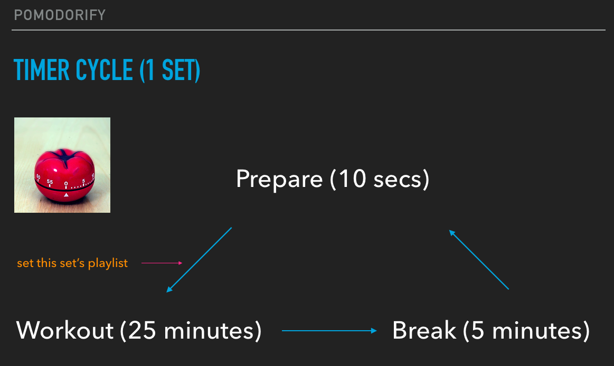
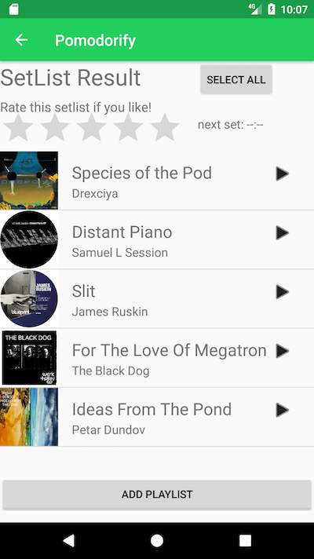

# Pomodorify

## about

### 🍅 Pomodoro Technique × Spotify 🎵

</img>
 
 
</img>

|media|value|
|---|---|
|term|2017.3(for 3 weeks)|
|stack|Android OS, Java|
|library|OkHttp, gson, Picasso|
|API|Spotify API|

## Function

Pomodoro technique is known as a method we can gain concentration efficiently. I came up with an idea that it works more if it goes along with a calm and minimal music. This app behaves just as a timer. But if you have a premium Spotify account, it also generates a nice playlist based on techno or minimal music and also works as a music player. Moreover, if you like the specific song or playlist they made, you can add them to your playlist on Spotify. Get an extraordinary concentration with this app!

</img>

</img>

</img>

