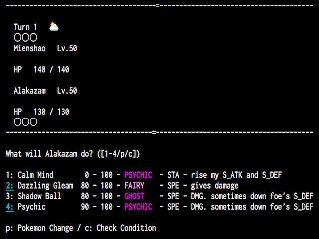

# Swifty Pokemon Battle α

## about

### High-Fidelity Pokemon Battle Simulator

|media|value
|---|---|
|term|2016.11(for 6 weeks)
|stack|mac OS X(10.11 El Capitan or above), Swift 3
|client|Terminal
|link|GitHub

## Function

Swifty Pokemon Battle α is a command line tool available on Terminal.app (Only for Mac OS). This app aims precise transplantation of original Pokemon Series. Under 6 Gen(XY/ORAS) environment, you can battle with 10 pokemons.

"Swifty" represents 3 features.

### High-Speed

You can enjoy Pokemon Battle anytime, with comfortable tempo.

### including a lot of manners of Swift

Swift, the language I adopted for this project introduces modern notations (e.g. Closures, Optional Types, Tuple, Type inference, Generics, Paradigm of Functional Programming...). I take those writing manners as many as possible so that I can induce power of this language.

### Wise AI

The word "swift" also means intelligent, wise. In this App, I persue possibility of AI equal to human's intelligence.

 
</img>
 
 
</img>
 
 
</img>
 
 
</img>
 
 
</img>
 
 
</img>
